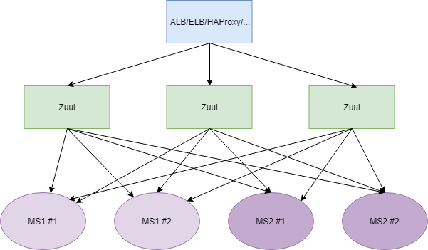
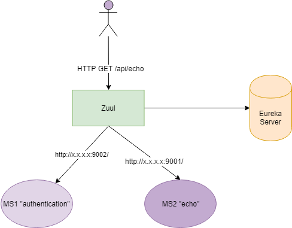

# Spring Cloud - Netflix Zuul

##### (aaand it's deprecated)

---

# Was ist ein API Gateway

- ~~Gateway~~ sondern Reverse Proxy
- Zentraler Dienst, über den alle HTTP-Anfragen laufen
- Mappt (idealerweise dynamisch) auf HTTP(S)-Backend-Dienste

---

# Übersicht

- Zuul ist von Netflix entwickelt worden
- API Gateway/Routing Service/Proxy
- Mit Java erweiterbarer HTTP-Proxy
- kein L4-Loadbalancer wie HAProxy

---

# Versionswirrwarr
- Spring Cloud (Spring Boot 2.0.4) nutzt Zuul 1.3
- Mittlerweile Zuul 2.1 verfügbar (non-blocking, HTTP/2, Mutual TLS usw.); 
- Spring Cloud Zuul wird nicht auf 2.x upgraden (https://www.youtube.com/watch?time_continue=1037&v=9wocKqF15B8)

---

# Alternativen
- Spring Cloud Gateway (Java)
- linkerd (Scala, Java)
- envoy (C++)
- NGINX (JavaScript, Lua)

---

# Netzwerk

---

# Anfragen

---

# Filter

- verändern den HTTP-Request (Header und/oder Body)
- pre/routing/post Filter
- Konzept ist bei Spring Cloud Gateway und Zuul 2 ähnlich

---

# Filter II

###### von https://github.com/Netflix/zuul/wiki/How-it-Works

---

# Quellcode

siehe dort